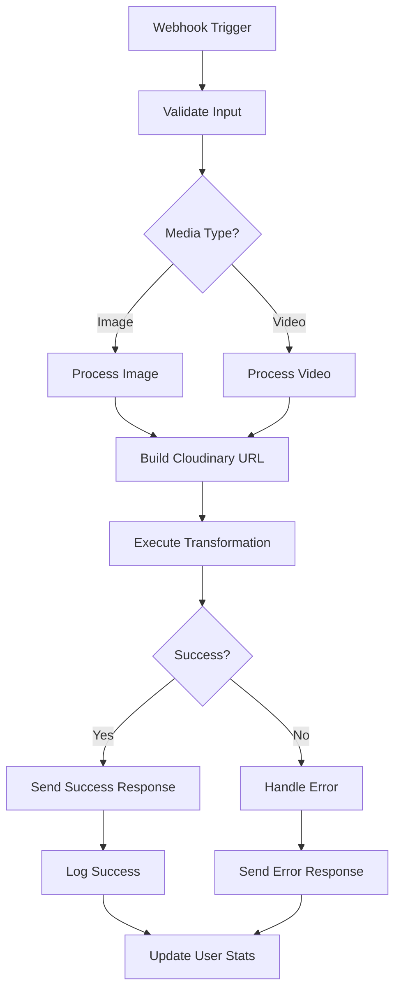

# 📋 ID 2 Development Plan
## Backend Integration & n8n Workflow Development

---

## 🎯 **PROJECT OVERVIEW**

### **Goal**
พัฒนา Backend Integration System เพื่อเชื่อมต่อ Frontend (ID 1) กับ Cloudinary API และ Telegram/Line Bot ผ่าน n8n Workflows

### **Scope**
- 🔗 n8n Webhook Development
- ☁️ Cloudinary API Integration  
- 📱 Telegram/Line Bot Responses
- 🔒 Error Handling & Validation
- ⚡ Performance Optimization

---

## 📊 **TECHNICAL REQUIREMENTS**

### **Input from ID 1 Frontend**
```json
{
  "media_url": "https://example.com/image.jpg",
  "media_type": "image", // or "video"
  "text_overlays": [
    {
      "text": "Sample Text",
      "position": {"x": 50, "y": 30},
      "style": {
        "font_family": "Arial",
        "font_size": 24,
        "color": "#FFFFFF",
        "background": "#FF0000",
        "effects": ["bold", "outline"]
      },
      "timing": { // for videos only
        "start": 0,
        "duration": 5
      }
    }
  ],
  "user_id": "telegram_123456",
  "timestamp": "2024-01-01T00:00:00Z",
  "callback_url": "https://t.me/your_bot"
}
```

### **Expected Output**
```json
{
  "success": true,
  "result_url": "https://res.cloudinary.com/demo/image/upload/...",
  "processing_time": 2.5,
  "file_size": 1024000,
  "format": "jpg",
  "transformations_applied": [
    "text_overlay_1",
    "positioning",
    "styling"
  ]
}
```

---

## 🔧 **N8N WORKFLOW ARCHITECTURE**

### **Main Workflow: Text Overlay Processing**


### **Webhook Configuration**
```javascript
// n8n Webhook Node Settings
{
  "httpMethod": "POST",
  "path": "text-overlay",
  "responseMode": "responseNode",
  "authentication": "none",
  "options": {
    "rawBody": false,
    "allowedOrigins": [
      "your-hosttinger-domain.com",
      "localhost"
    ]
  }
}
```

---

## 🛠️ **WORKFLOW DEVELOPMENT PHASES**

### **Phase 1: Core Webhook Handler (Day 1)**

#### **1.1 Input Validation Node**
```javascript
// JavaScript Code Node - Input Validation
const requiredFields = ['media_url', 'media_type', 'text_overlays', 'user_id'];
const input = $json.body;

// Validate required fields
for (const field of requiredFields) {
  if (!input[field]) {
    return [{
      json: {
        error: `Missing required field: ${field}`,
        status: 400,
        timestamp: new Date().toISOString()
      }
    }];
  }
}

// Validate media_type
if (!['image', 'video'].includes(input.media_type)) {
  return [{
    json: {
      error: 'Invalid media_type. Must be "image" or "video"',
      status: 400
    }
  }];
}

// Validate text_overlays structure
if (!Array.isArray(input.text_overlays) || input.text_overlays.length === 0) {
  return [{
    json: {
      error: 'text_overlays must be a non-empty array',
      status: 400
    }
  }];
}

// Validate each overlay
for (const [index, overlay] of input.text_overlays.entries()) {
  if (!overlay.text || !overlay.position || !overlay.style) {
    return [{
      json: {
        error: `Invalid overlay at index ${index}. Missing required properties.`,
        status: 400
      }
    }];
  }
  
  // Validate position
  if (typeof overlay.position.x !== 'number' || typeof overlay.position.y !== 'number') {
    return [{
      json: {
        error: `Invalid position at overlay ${index}. x and y must be numbers.`,
        status: 400
      }
    }];
  }
  
  // Validate position range (0-100%)
  if (overlay.position.x < 0 || overlay.position.x > 100 ||
      overlay.position.y < 0 || overlay.position.y > 100) {
    return [{
      json: {
        error: `Position values must be between 0 and 100 (percentage)`,
        status: 400
      }
    }];
  }
}

// If all validation passes
return [{
  json: {
    ...input,
    status: 'validated',
    validation_time: new Date().toISOString()
  }
}];
```

#### **1.2 Media Type Router**
```javascript
// Switch Node Configuration
const mediaType = $json.media_type;

// Route based on media type
if (mediaType === 'image') {
  return [{ json: { route: 'image', ...$json } }];
} else if (mediaType === 'video') {
  return [{ json: { route: 'video', ...$json } }];
} else {
  return [{ json: { route: 'error', error: 'Unsupported media type' } }];
}
```

### **Phase 2: Cloudinary Integration (Day 2-3)**

#### **2.1 Image Processing Workflow**
```javascript
// JavaScript Code Node - Build Cloudinary Image URL
const { media_url, text_overlays } = $json;

// Helper function to convert position percentage to Cloudinary gravity
function calculateGravity(x, y) {
  if (y <= 33) {
    if (x <= 33) return 'north_west';
    if (x >= 67) return 'north_east';
    return 'north';
  } else if (y >= 67) {
    if (x <= 33) return 'south_west';
    if (x >= 67) return 'south_east';
    return 'south';
  } else {
    if (x <= 33) return 'west';
    if (x >= 67) return 'east';
    return 'center';
  }
}

// Helper function to calculate offset from gravity
function calculateOffset(x, y, gravity) {
  const offsetX = gravity.includes('west') ? x : 
                  gravity.includes('east') ? (100 - x) : 
                  Math.abs(x - 50);
  
  const offsetY = gravity.includes('north') ? y : 
                  gravity.includes('south') ? (100 - y) : 
                  Math.abs(y - 50);
  
  return {
    x: Math.round(offsetX),
    y: Math.round(offsetY)
  };
}

// Build transformation string
let transformations = [];

text_overlays.forEach((overlay, index) => {
  const gravity = calculateGravity(overlay.position.x, overlay.position.y);
  const offset = calculateOffset(overlay.position.x, overlay.position.y, gravity);
  
  // Build text transformation
  let textTransform = `l_text:${overlay.style.font_family}_${overlay.style.font_size}:${encodeURIComponent(overlay.text)}`;
  
  // Add positioning
  textTransform += `,g_${gravity}`;
  if (offset.x > 0) textTransform += `,x_${offset.x}`;
  if (offset.y > 0) textTransform += `,y_${offset.y}`;
  
  // Add styling
  if (overlay.style.color && overlay.style.color !== '#FFFFFF') {
    const color = overlay.style.color.replace('#', '');
    textTransform += `,co_rgb:${color}`;
  }
  
  if (overlay.style.background && overlay.style.background !== 'transparent') {
    const bgColor = overlay.style.background.replace('#', '');
    textTransform += `,b_rgb:${bgColor}`;
  }
  
  // Add effects
  if (overlay.style.effects) {
    overlay.style.effects.forEach(effect => {
      switch (effect) {
        case 'bold':
          textTransform = textTransform.replace(`_${overlay.style.font_size}:`, `_${overlay.style.font_size}_bold:`);
          break;
        case 'italic':
          textTransform = textTransform.replace(`_${overlay.style.font_size}:`, `_${overlay.style.font_size}_italic:`);
          break;
        case 'outline':
          textTransform += `,bo_2px_solid_rgb:000000`;
          break;
      }
    });
  }
  
  // Close layer
  textTransform += '/fl_layer_apply';
  
  transformations.push(textTransform);
});

// Combine all transformations
const transformString = transformations.join('/');

// Extract public_id from media_url
const publicId = media_url.split('/').pop().split('.')[0];

// Build final Cloudinary URL
const cloudinaryUrl = `https://res.cloudinary.com/${process.env.CLOUDINARY_CLOUD_NAME}/image/upload/${transformString}/${publicId}.jpg`;

return [{
  json: {
    cloudinary_url: cloudinaryUrl,
    transformation_string: transformString,
    public_id: publicId,
    processing_type: 'image',
    overlay_count: text_overlays.length
  }
}];
```

#### **2.2 Video Processing Workflow**
```javascript
// JavaScript Code Node - Build Cloudinary Video URL
const { media_url, text_overlays } = $json;

// Build video transformations
let transformations = [];

text_overlays.forEach((overlay, index) => {
  const gravity = calculateGravity(overlay.position.x, overlay.position.y);
  const offset = calculateOffset(overlay.position.x, overlay.position.y, gravity);
  
  // Build text transformation for video
  let textTransform = `l_text:${overlay.style.font_family}_${overlay.style.font_size}:${encodeURIComponent(overlay.text)}`;
  
  // Add positioning
  textTransform += `,g_${gravity}`;
  if (offset.x > 0) textTransform += `,x_${offset.x}`;
  if (offset.y > 0) textTransform += `,y_${offset.y}`;
  
  // Add timing for video
  if (overlay.timing) {
    if (overlay.timing.start > 0) {
      textTransform += `,so_${overlay.timing.start}`;
    }
    if (overlay.timing.duration > 0) {
      textTransform += `,eo_${overlay.timing.start + overlay.timing.duration}`;
    }
  }
  
  // Add styling (same as image)
  if (overlay.style.color && overlay.style.color !== '#FFFFFF') {
    const color = overlay.style.color.replace('#', '');
    textTransform += `,co_rgb:${color}`;
  }
  
  if (overlay.style.background && overlay.style.background !== 'transparent') {
    const bgColor = overlay.style.background.replace('#', '');
    textTransform += `,b_rgb:${bgColor}`;
  }
  
  // Close layer
  textTransform += '/fl_layer_apply';
  
  transformations.push(textTransform);
});

// Combine all transformations
const transformString = transformations.join('/');

// Extract public_id from media_url
const publicId = media_url.split('/').pop().split('.')[0];

// Build final Cloudinary URL
const cloudinaryUrl = `https://res.cloudinary.com/${process.env.CLOUDINARY_CLOUD_NAME}/video/upload/${transformString}/${publicId}.mp4`;

return [{
  json: {
    cloudinary_url: cloudinaryUrl,
    transformation_string: transformString,
    public_id: publicId,
    processing_type: 'video',
    overlay_count: text_overlays.length
  }
}];
```

#### **2.3 Cloudinary API Call**
```javascript
// HTTP Request Node Configuration
{
  "method": "GET",
  "url": "={{ $json.cloudinary_url }}",
  "options": {
    "timeout": 30000,
    "redirect": "follow",
    "followRedirect": true,
    "followAllRedirects": true
  },
  "headers": {
    "User-Agent": "n8n-text-overlay-bot/1.0"
  }
}
```

#### **2.4 Response Processing**
```javascript
// JavaScript Code Node - Process Cloudinary Response
const response = $json;

if (response.statusCode === 200) {
  // Get file info
  const contentLength = parseInt(response.headers['content-length'] || '0');
  const contentType = response.headers['content-type'] || 'unknown';
  
  return [{
    json: {
      success: true,
      result_url: $json.cloudinary_url,
      file_size: contentLength,
      content_type: contentType,
      processing_time: new Date() - new Date($json.validation_time),
      timestamp: new Date().toISOString()
    }
  }];
} else {
  return [{
    json: {
      success: false,
      error: `Cloudinary processing failed with status ${response.statusCode}`,
      status_code: response.statusCode,
      timestamp: new Date().toISOString()
    }
  }];
}
```

### **Phase 3: Telegram/Line Integration (Day 3-4)**

#### **3.1 Telegram Success Response**
```javascript
// HTTP Request Node - Send to Telegram
const { user_id, result_url, processing_time } = $json;

const message = {
  chat_id: user_id,
  photo: result_url,
  caption: `✅ Text overlay สร้างเสร็จแล้ว!\n⏱️ ใช้เวลา: ${processing_time.toFixed(1)} วินาทีนะ\n\n🔗 ลิงค์รูป: ${result_url}`,
  reply_markup: {
    inline_keyboard: [
      [
        { text: "📱 แก้ไขเพิ่มเติม", url: `https://your-domain.com/text-overlay?edit=${result_url}` },
        { text: "💾 บันทึกเป็น Template", callback_data: `save_template_${result_url}` }
      ],
      [
        { text: "🆕 สร้างใหม่", callback_data: "create_new" },
        { text: "📋 ดูประวัติ", callback_data: "view_history" }
      ]
    ]
  }
};

return [{
  json: {
    method: "POST",
    url: `https://api.telegram.org/bot${process.env.TELEGRAM_BOT_TOKEN}/sendPhoto`,
    body: message,
    headers: {
      "Content-Type": "application/json"
    }
  }
}];
```

#### **3.2 LINE Success Response**
```javascript
// HTTP Request Node - Send to LINE
const { user_id, result_url } = $json;

const message = {
  to: user_id,
  messages: [
    {
      type: "image",
      originalContentUrl: result_url,
      previewImageUrl: result_url
    },
    {
      type: "flex",
      altText: "Text overlay สร้างเสร็จแล้ว",
      contents: {
        type: "bubble",
        body: {
          type: "box",
          layout: "vertical",
          contents: [
            {
              type: "text",
              text: "✅ Text overlay สร้างเสร็จแล้ว!",
              weight: "bold",
              size: "lg"
            },
            {
              type: "text",
              text: `⏱️ ใช้เวลา: ${processing_time.toFixed(1)} วินาที`,
              size: "sm",
              color: "#666666"
            }
          ]
        },
        footer: {
          type: "box",
          layout: "vertical",
          spacing: "sm",
          contents: [
            {
              type: "button",
              style: "primary",
              action: {
                type: "uri",
                label: "📱 แก้ไขเพิ่มเติม",
                uri: `https://your-domain.com/text-overlay?edit=${result_url}`
              }
            },
            {
              type: "button",
              action: {
                type: "postback",
                label: "🆕 สร้างใหม่",
                data: "action=create_new"
              }
            }
          ]
        }
      }
    }
  ]
};

return [{
  json: {
    method: "POST",
    url: "https://api.line.me/v2/bot/message/push",
    body: message,
    headers: {
      "Content-Type": "application/json",
      "Authorization": `Bearer ${process.env.LINE_CHANNEL_TOKEN}`
    }
  }
}];
```

### **Phase 4: Error Handling & Monitoring (Day 4-5)**

#### **4.1 Error Handler Workflow**
```javascript
// JavaScript Code Node - Error Processing
const error = $json.error || 'Unknown error occurred';
const user_id = $json.user_id;
const error_code = $json.status || 500;

// Log error details
console.error('Text Overlay Error:', {
  user_id,
  error,
  error_code,
  timestamp: new Date().toISOString(),
  input_data: $json
});

// Determine error type and response
let errorMessage = '';
let shouldRetry = false;

switch (error_code) {
  case 400:
    errorMessage = '❌ ข้อมูลที่ส่งมาไม่ถูกต้อง กรุณาลองใหม่อีกครั้ง';
    break;
  case 413:
    errorMessage = '❌ ไฟล์ใหญ่เกินไป (สูงสุด 50MB)';
    break;
  case 429:
    errorMessage = '⏳ ระบบขณะนี้ใช้งานหนัก กรุณารอสักครู่แล้วลองใหม่';
    shouldRetry = true;
    break;
  case 500:
    errorMessage = '⚠️ เกิดข้อผิดพลาดของระบบ กรุณาติดต่อผู้ดูแล';
    shouldRetry = true;
    break;
  default:
    errorMessage = `❌ เกิดข้อผิดพลาด: ${error}`;
}

return [{
  json: {
    error_message: errorMessage,
    should_retry: shouldRetry,
    error_code,
    user_id,
    timestamp: new Date().toISOString()
  }
}];
```

#### **4.2 Monitoring & Analytics**
```javascript
// JavaScript Code Node - Usage Analytics
const { user_id, success, processing_time, overlay_count } = $json;

// Prepare analytics data
const analyticsData = {
  user_id,
  timestamp: new Date().toISOString(),
  success,
  processing_time: processing_time || 0,
  overlay_count: overlay_count || 0,
  date: new Date().toISOString().split('T')[0],
  hour: new Date().getHours()
};

// Store in Google Sheets for analytics
return [{
  json: {
    range: 'Analytics!A:G',
    values: [[
      analyticsData.timestamp,
      analyticsData.user_id,
      analyticsData.success ? 'SUCCESS' : 'ERROR',
      analyticsData.processing_time,
      analyticsData.overlay_count,
      analyticsData.date,
      analyticsData.hour
    ]]
  }
}];
```

---

## 🔧 **OPTIMIZATION & CACHING**

### **5.1 Response Caching**
```javascript
// JavaScript Code Node - Cache Management
const cacheKey = `overlay_${JSON.stringify($json.text_overlays)}_${$json.media_url}`;

// Check cache first
const cached = global.overlayCache?.[cacheKey];
if (cached && (Date.now() - cached.timestamp) < 3600000) { // 1 hour cache
  return [{
    json: {
      ...cached.data,
      from_cache: true
    }
  }];
}

// If not in cache, continue processing
return [{ json: { cache_key: cacheKey, ...$json } }];
```

### **5.2 Rate Limiting**
```javascript
// JavaScript Code Node - Rate Limiting
const user_id = $json.user_id;
const now = Date.now();

// Initialize rate limit storage
if (!global.rateLimits) global.rateLimits = {};
if (!global.rateLimits[user_id]) global.rateLimits[user_id] = [];

// Clean old entries (older than 1 minute)
global.rateLimits[user_id] = global.rateLimits[user_id]
  .filter(timestamp => now - timestamp < 60000);

// Check rate limit (max 10 requests per minute)
if (global.rateLimits[user_id].length >= 10) {
  return [{
    json: {
      error: 'Rate limit exceeded. Maximum 10 requests per minute.',
      status: 429,
      retry_after: 60
    }
  }];
}

// Add current request
global.rateLimits[user_id].push(now);

return [{ json: $json }];
```

---

## 🚀 **DEPLOYMENT & CONFIGURATION**

### **Environment Variables**
```bash
# Cloudinary Configuration
CLOUDINARY_CLOUD_NAME=your_cloud_name
CLOUDINARY_API_KEY=your_api_key
CLOUDINARY_API_SECRET=your_api_secret

# Bot Tokens
TELEGRAM_BOT_TOKEN=your_telegram_token
LINE_CHANNEL_TOKEN=your_line_token
LINE_CHANNEL_SECRET=your_line_secret

# Application URLs
FRONTEND_URL=https://your-domain.com
WEBHOOK_BASE_URL=https://your-n8n.com/webhook

# Database (optional)
GOOGLE_SHEETS_ID=your_sheet_id
GOOGLE_SERVICE_ACCOUNT=base64_encoded_credentials
```

### **n8n Workflow Import/Export**
```json
{
  "name": "Text Overlay Processing",
  "nodes": [
    {
      "parameters": {
        "httpMethod": "POST",
        "path": "text-overlay",
        "responseMode": "responseNode"
      },
      "name": "Webhook",
      "type": "n8n-nodes-base.webhook"
    },
    // ... other nodes
  ],
  "connections": {
    "Webhook": {
      "main": [
        [
          {
            "node": "Input Validation",
            "type": "main",
            "index": 0
          }
        ]
      ]
    }
  }
}
```

---

## 🧪 **TESTING STRATEGY**

### **Unit Testing**
```javascript
// Test Cases for Input Validation
const testCases = [
  {
    name: 'Valid image input',
    input: {
      media_url: 'https://example.com/image.jpg',
      media_type: 'image',
      text_overlays: [{
        text: 'Test',
        position: {x: 50, y: 50},
        style: {font_family: 'Arial', font_size: 24, color: '#FFFFFF'}
      }],
      user_id: 'test_user'
    },
    expected: { status: 'validated' }
  },
  {
    name: 'Invalid position values',
    input: {
      media_url: 'https://example.com/image.jpg',
      media_type: 'image',
      text_overlays: [{
        text: 'Test',
        position: {x: 150, y: -10}, // Invalid range
        style: {font_family: 'Arial', font_size: 24}
      }],
      user_id: 'test_user'
    },
    expected: { error: 'Position values must be between 0 and 100' }
  }
];
```

### **Integration Testing**
- **Webhook endpoint testing**
- **Cloudinary API response validation**  
- **Telegram/Line bot integration**
- **Error handling verification**
- **Performance benchmarking**

---

## 📊 **PERFORMANCE MONITORING**

### **Key Metrics**
- **Response Time**: < 5 seconds average
- **Success Rate**: > 95%
- **Uptime**: > 99.5%
- **Error Rate**: < 2%
- **Cache Hit Rate**: > 60%

### **Alerting Rules**
- Response time > 10 seconds
- Error rate > 5% in 5 minutes
- Queue size > 100 pending requests
- Cloudinary API errors > 3 consecutive failures

---

## 💰 **COST ESTIMATION**

### **Development Time**
- **n8n Workflow Development**: 3 days
- **API Integration**: 2 days  
- **Testing & Debugging**: 2 days
- **Documentation**: 1 day
- **Total**: 8 days

### **Expected Claude Code Usage**
- **Estimated**: 70-90 USD
- **Buffer**: 10 USD for optimizations
- **Total Budget**: 100 USD (within remaining budget)

---

## 🔄 **INTEGRATION WITH ID 1**

### **Frontend Requirements**
- **Webhook URL**: To be provided by ID 2
- **Response Format**: Standardized JSON structure
- **Error Handling**: Frontend error display
- **Loading States**: Progress indicators

### **Testing Coordination**
- **Mock Responses**: For frontend development
- **Staging Environment**: Shared testing space
- **API Documentation**: Complete endpoint specs

---

## 🛠️ **MAINTENANCE & SUPPORT**

### **Monitoring Dashboard**
- Real-time request monitoring
- Error tracking and alerting  
- Performance metrics visualization
- User analytics and insights

### **Backup & Recovery**
- Workflow configuration backup
- Analytics data preservation
- Error log retention (30 days)
- Performance history (90 days)

---

## 📈 **SUCCESS CRITERIA**

### **Functional Requirements**
- ✅ Process 95%+ of valid requests successfully
- ✅ Response time under 5 seconds average
- ✅ Support both image and video processing
- ✅ Handle all styling options from frontend
- ✅ Proper error handling and user feedback

### **Non-Functional Requirements**  
- ✅ Scale to 100+ concurrent requests
- ✅ 99.5% uptime during business hours
- ✅ Secure API endpoints
- ✅ Comprehensive logging and monitoring
- ✅ Easy maintenance and updates

---

## 🔮 **FUTURE ENHANCEMENTS**

### **Advanced Features**
- **Batch Processing**: Multiple overlays in one request
- **AI Optimization**: Smart positioning suggestions
- **Template Engine**: Reusable overlay templates
- **Analytics API**: Usage statistics endpoint
- **Webhook Security**: Request signing and verification

### **Performance Optimizations**
- **CDN Caching**: Cached transformed images
- **Redis Integration**: Advanced caching layer
- **Load Balancing**: Multiple n8n instances
- **Background Processing**: Async heavy operations

---

*📝 End of ID 2 Development Plan*